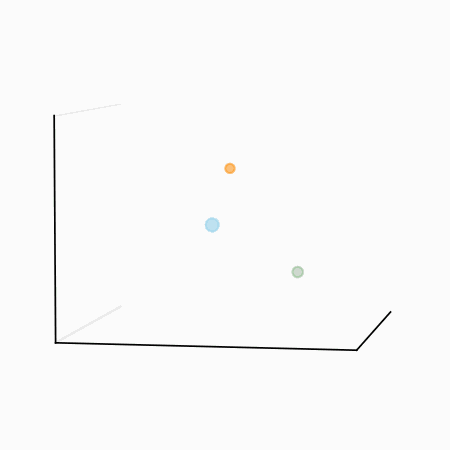

# Three-body problem

In this notebook, I implement a simple animated three-body simulation using Python, the results of which yield graphics like the following:

The code to generate this GIF is included in the [3body](3body.ipynb) Jupyter notebook.